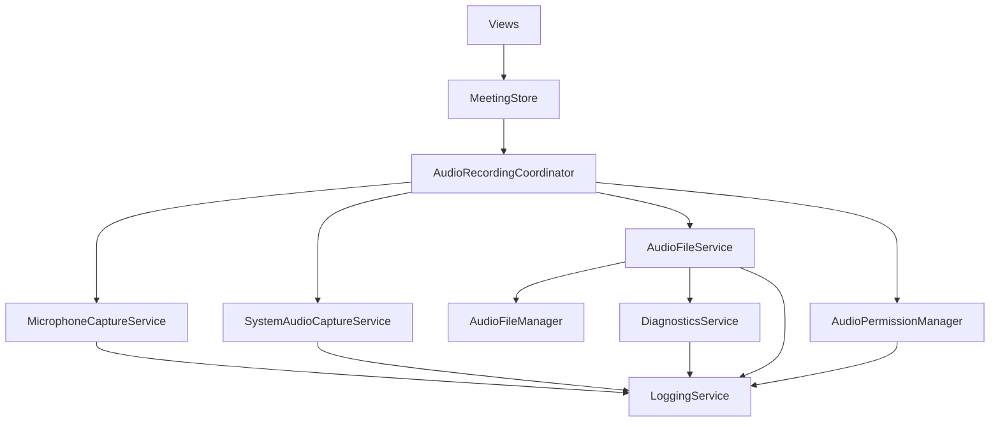

# Documentação dos Services - Meeting Recorder macOS

## 📋 Visão Geral

Este documento descreve os services principais do Meeting Recorder macOS, suas responsabilidades e como interagem entre si.

## 🏗️ Arquitetura dos Services



## 🎯 Services Principais

### 1. AudioRecordingCoordinator

**Responsabilidade:** Orquestração de alto nível da gravação de áudio

**Localização:** `Sources/Services/Recording/AudioRecordingCoordinator.swift`

#### Funcionalidades:
- Coordena captura de microfone e áudio do sistema
- Gerencia estado da gravação (start/stop/pause/resume)
- Controla timing e duração
- Interface principal para ViewModels

#### Métodos Principais:
```swift
func initialize() async
func startRecording(for meeting: Meeting) async -> Bool
func stopRecording() -> (audioPath: String?, duration: TimeInterval)
func pauseRecording()
func resumeRecording()
```

#### Dependências:
- `MicrophoneCaptureService`
- `SystemAudioCaptureService`
- `AudioFileService`
- `AudioPermissionManager`

---

### 2. AudioFileService

**Responsabilidade:** Gerenciamento especializado de arquivos de áudio durante gravação

**Localização:** `Sources/Services/AudioFile/AudioFileService.swift`

#### Funcionalidades:
- Criação e configuração de arquivos de áudio
- Escrita thread-safe de buffers de áudio
- Combinação de arquivos de microfone e sistema
- Validação de integridade de arquivos

#### Métodos Principais:
```swift
func setupAudioFiles(for meetingId: UUID, configuration: AudioConfiguration) async throws
func writeMicrophoneAudio(_ buffer: AVAudioPCMBuffer)
func writeSystemAudio(_ buffer: AVAudioPCMBuffer)
func processRecordingFiles() -> String?
func finalizeFiles()
```

#### Características:
- **Thread-safe**: Usa `DispatchQueue` para escrita de arquivos
- **Diagnósticos integrados**: Tracking automático de buffers
- **Fallback**: Retorna arquivo de microfone se combinação falhar

---

### 3. LoggingService

**Responsabilidade:** Sistema unificado de logging estruturado

**Localização:** `Sources/Services/Logging/LoggingService.swift`

#### Funcionalidades:
- Logging categorizado por funcionalidade
- Diferentes níveis de log (debug, info, warning, error, critical)
- Métodos especializados para eventos de áudio
- Monitoramento de performance com timing automático

#### Categorias de Log:
```swift
enum LogCategory: String {
    case general = "General"
    case audio = "Audio"
    case recording = "Recording"
    case file = "File"
    case ui = "UI"
    case performance = "Performance"
    case diagnostics = "Diagnostics"
}
```

#### Métodos Especializados:
```swift
func audioEvent(_ message: String, details: [String: Any] = [:])
func recordingEvent(_ message: String, meetingId: UUID? = nil)
func fileOperation(_ message: String, path: String? = nil)
func performance(_ message: String, duration: TimeInterval? = nil)
```

#### Exemplo de Uso:
```swift
logger.audioEvent("Microphone capture started", details: [
    "sampleRate": 44100,
    "channels": 2,
    "device": "MacBook Pro Microphone"
])
```

---

### 4. DiagnosticsService

**Responsabilidade:** Diagnósticos e monitoramento do sistema de áudio

**Localização:** `Sources/Services/Diagnostics/DiagnosticsService.swift`

#### Funcionalidades:
- Tracking de buffers de áudio recebidos
- Validação de formatos de áudio
- Diagnósticos automáticos após delay
- Sugestões de troubleshooting
- Monitoramento de performance

#### Métodos de Tracking:
```swift
func trackMicrophoneBuffer(_ buffer: AVAudioPCMBuffer)
func trackSystemAudioBuffer(_ buffer: AVAudioPCMBuffer)
func trackMicrophoneFileWrite()
func trackSystemAudioFileWrite()
```

#### Diagnósticos Automáticos:
```swift
func performBufferCheck(after delay: TimeInterval = 5.0)
func logSystemCapabilities()
func validateAudioFormats(fileFormat: AVAudioFormat, bufferFormat: AVAudioFormat) -> Bool
```

#### Performance Monitoring:
```swift
func monitorPerformance<T>(operation: String, _ block: () throws -> T) rethrows -> T
func monitorAsyncPerformance<T>(operation: String, _ block: () async throws -> T) async rethrows -> T
```

---

### 5. MicrophoneCaptureService

**Responsabilidade:** Captura especializada de áudio do microfone

**Localização:** `Sources/Services/Audio/Capture/MicrophoneCaptureService.swift`

#### Funcionalidades:
- Gerenciamento de dispositivos de entrada
- Configuração de AVAudioEngine
- Captura de buffers de áudio
- Conversão de formato quando necessário
- Fallback para microfone interno

#### Características Técnicas:
- **Retry Logic**: Múltiplas tentativas de inicialização
- **Device Management**: Listagem e seleção de dispositivos
- **Format Conversion**: Adaptação automática de sample rates
- **Fallback Strategy**: Microfone interno como backup

---

### 6. SystemAudioCaptureService

**Responsabilidade:** Captura de áudio do sistema usando ScreenCaptureKit

**Localização:** `Sources/Services/Audio/Capture/SystemAudioCaptureService.swift`

#### Funcionalidades:
- Captura de áudio do sistema (macOS 13+)
- Gerenciamento de permissões ScreenCaptureKit
- Configuração de SCStream
- Processamento de CMSampleBuffer

#### Requisitos:
- **macOS 13+**: ScreenCaptureKit disponível
- **Permissões**: Screen Recording permissions
- **Exclusões**: Configuração de excludesCurrentProcessAudio

---

## 🔄 Fluxo de Gravação

### 1. Inicialização
```
MeetingStore.startNewRecording()
    ↓
AudioRecordingCoordinator.startRecording()
    ↓
AudioFileService.setupAudioFiles()
    ↓
MicrophoneCaptureService.startCapture()
    ↓
SystemAudioCaptureService.startCapture() (se habilitado)
```

### 2. Durante Gravação
```
Audio Buffers → AudioFileService.writeMicrophoneAudio()
                    ↓
                DiagnosticsService.trackMicrophoneBuffer()
                    ↓
                Thread-safe file writing
```

### 3. Finalização
```
AudioRecordingCoordinator.stopRecording()
    ↓
AudioFileService.finalizeFiles()
    ↓
AudioFileService.processRecordingFiles()
    ↓
Combine files (if system audio exists)
    ↓
Return final audio path
```

## 🛠️ Configuração e Dependências

### Injeção de Dependências

O projeto usa injeção de dependências para facilitar testes e manutenção:

```swift
// AudioRecordingCoordinator
init(
    microphoneService: MicrophoneCaptureProtocol,
    systemAudioService: SystemAudioCaptureProtocol,
    audioFileManager: AudioFileManagerProtocol,
    permissionManager: AudioPermissionManager,
    formatConverter: AudioConverterProtocol,
    synchronizer: AudioSynchronizerProtocol
)

// AudioFileService
init(audioFileManager: AudioFileManagerProtocol)
```

### Protocolos

Os services implementam protocolos para facilitar testes e substituição:

- `MicrophoneCaptureProtocol`
- `SystemAudioCaptureProtocol`
- `AudioFileManagerProtocol`
- `AudioConverterProtocol`

## 📊 Monitoramento e Diagnósticos

### Logging Estruturado

Todos os services usam o `LoggingService` para logging consistente:

```swift
// Eventos de áudio
logger.audioEvent("Buffer received", details: ["frames": buffer.frameLength])

// Eventos de gravação
logger.recordingEvent("Recording started", meetingId: meeting.id)

// Operações de arquivo
logger.fileOperation("File created", path: audioPath)

// Performance
logger.performance("File processing", duration: 2.5)
```

### Diagnósticos Automáticos

O `DiagnosticsService` fornece diagnósticos automáticos:

- **Buffer Tracking**: Conta buffers recebidos
- **Format Validation**: Verifica compatibilidade de formatos
- **Troubleshooting**: Sugestões automáticas para problemas
- **Performance**: Monitoramento de operações críticas

### Exemplo de Log de Diagnóstico

```
[Audio] 🎵 First microphone buffer received | sampleRate: 44100, channels: 2, frames: 1024
[Recording] 🎙️ Recording started | Meeting: 12345678
[File] 📁 Audio files setup completed | Path: /path/to/audio
[Performance] ⚡ ✅ Completed: File processing | Duration: 1.234s
[Diagnostics] Buffer diagnostics check
```

## 🧪 Testes e Qualidade

### Testabilidade

A arquitetura facilita testes unitários:

- **Protocolos**: Permitem mocking de dependências
- **Injeção de Dependências**: Facilita substituição para testes
- **Single Responsibility**: Cada service tem escopo bem definido

### Exemplo de Mock

```swift
class MockMicrophoneService: MicrophoneCaptureProtocol {
    var onAudioReceived: ((AVAudioPCMBuffer, UInt64) -> Void)?
    var isCapturing = false
    var isPaused = false
    
    func startCapture(configuration: AudioConfiguration) async throws {
        isCapturing = true
        // Simulate audio capture
    }
}
```

## 🔧 Manutenção e Evolução

### Adicionando Novos Services

1. Criar protocolo se necessário
2. Implementar service seguindo padrões existentes
3. Usar `LoggingService` para logging
4. Integrar com `DiagnosticsService` se aplicável
5. Adicionar injeção de dependência
6. Documentar no SERVICES_DOCUMENTATION.md

### Padrões a Seguir

- **Single Responsibility**: Uma responsabilidade por service
- **Dependency Injection**: Injetar dependências via init
- **Protocol-Oriented**: Usar protocolos para abstrações
- **Logging Estruturado**: Usar LoggingService com categorias
- **Error Handling**: Logging de erros com contexto
- **Async/Await**: Para operações assíncronas
- **Thread Safety**: Para operações concorrentes

---

**Última atualização:** Junho 2024  
**Versão:** 1.0  
**Autor:** Equipe de Desenvolvimento 