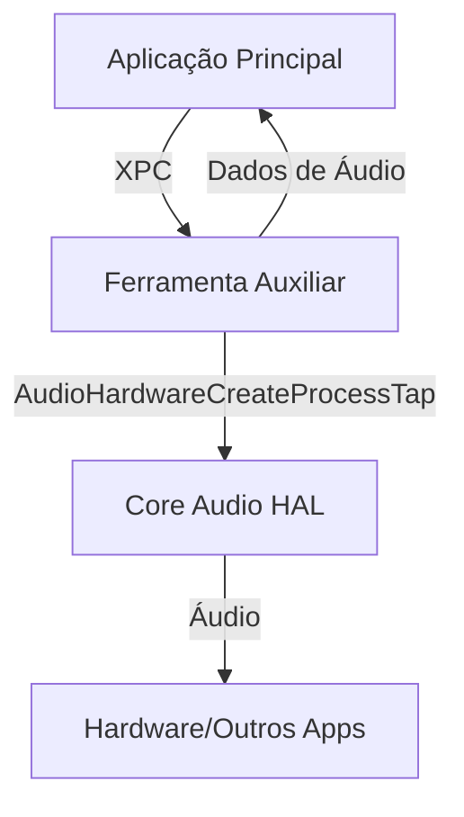

# Guia Detalhado para Implementação de Captura de Áudio do Sistema em macOS Utilizando Core Audio Taps

## 1. Introdução à Captura de Áudio do Sistema em macOS

A captura de áudio do sistema em macOS é uma tarefa que apresenta complexidades inerentes, primariamente devido à robusta arquitetura de segurança e privacidade da Apple. Ao longo dos anos, o macOS tem evoluído no sentido de reforçar a proteção dos dados do utilizador e a estabilidade do sistema, resultando em controlos cada vez mais rigorosos sobre o acesso a fluxos de áudio entre aplicações.

Esta abordagem significa que a captura de áudio do sistema não é uma funcionalidade trivial de implementar, exigindo frequentemente o uso de:
- *Entitlements* especiais
- Consentimento explícito do utilizador
- Workarounds arquiteturais como ferramentas auxiliares privilegiadas

A compreensão destas restrições é fundamental para qualquer programador que pretenda desenvolver aplicações com esta capacidade.

### Mecanismos de "Core Audio Taps"

O termo "Core Audio Taps" pode abranger diversos mecanismos. É crucial distinguir entre eles:

#### 1. MTAudioProcessingTap (AVFoundation)
- **Propósito**: Manipulação de fluxos de áudio dentro de uma aplicação
- **Funcionalidade**: Permite aceder a uma faixa de áudio (ex: de um AVPlayerItem) antes da reprodução, leitura ou exportação
- **Caso de uso**: Visualização de áudio ou aplicação de efeitos em tempo real
- **Limitação**: Não é uma solução direta para capturar áudio do sistema ou de outras aplicações

#### 2. AudioHardwareCreateProcessTap (Core Audio HAL)
- **Nível**: Baixo nível (Hardware Abstraction Layer)
- **Objetivo**: Capturar saída de áudio de um processo específico (por PID)
- **Desafio**: Obstáculos de segurança significativos
- **Uso**: Limitado em aplicações padrão

#### 3. CATap (Core Audio, macOS Sonoma 14.2+)
- **Tipo**: API recente da Apple
- **Função**: Capturar áudio de aplicações e dispositivos de saída
- **Vantagem**: Caminho mais simples e sancionado pela Apple
- **Compatibilidade**: macOS Sonoma 14.2 ou superior

#### 4. Dispositivos de Áudio Virtuais
- **Exemplos**: BlackHole, Soundflower
- **Funcionamento**: Criam entradas/saídas de áudio virtuais
- **Mecanismo**: "Loopback" - redireciona áudio para saída virtual
- **Uso**: Pode ser usado como entrada por aplicações de gravação

#### 5. ScreenCaptureKit
- **Principal função**: Gravação de ecrã
- **Funcionalidade adicional**: Captura de áudio do sistema associado à gravação de ecrã
## 2. Desafios de Segurança no Acesso ao Áudio do Sistema

### O Problema Fundamental

O desafio fundamental reside em aceder a áudio que está fora do sandbox da aplicação ou do espaço do seu processo. As políticas de segurança do macOS geralmente impedem que um processo de aplicação padrão "intercete" diretamente outros processos ou a saída de áudio global do sistema sem:

- Consentimento explícito do utilizador
- Privilégios elevados
- Mecanismos específicos ao nível do sistema operativo

Esta restrição não é um mero detalhe técnico, mas uma decisão de design deliberada da Apple para proteger os utilizadores contra software malicioso que poderia gravar áudio sem consentimento.

### A Evolução com a CATap

A introdução da CATap no macOS Sonoma 14.2[^6] sinaliza um reconhecimento por parte da Apple da necessidade de métodos mais diretos para a captura de áudio do sistema. 

**Contexto Histórico:**
- Tarefa tradicionalmente complexa
- Exigia extensões de kernel (kexts) - agora preteridas
- Uso de ferramentas auxiliares privilegiadas

**Mudança de Paradigma:**
A CATap representa uma abordagem mais moderna, oferecendo uma API potencialmente mais amigável para a App Store, possivelmente influenciada por:
- Sucesso de ferramentas como BlackHole
- Complexidades enfrentadas pelos programadores
- Necessidade de soluções mais robustas

### Implicações para os Programadores

- **Versões Recentes do macOS**: Caminho simplificado através da CATap
- **Compatibilidade com Versões Anteriores**: Necessidade de métodos mais antigos e complexos
- **Futuro**: Potencial redução na dependência de drivers de áudio virtuais de terceiros

### A Tensão Fundamental

A dificuldade central na captura de áudio do sistema decorre de uma tensão entre:

1. **Segurança e Privacidade**
   - Modelo robusto da Apple
   - Sandboxing rigoroso
   - Restrições de acesso a recursos do sistema

2. **Necessidades dos Programadores e Utilizadores**
   - Funcionalidades legítimas de captura de áudio
   - Experiência do utilizador aprimorada
   - Flexibilidade no desenvolvimento

### Consequências das Restrições de Segurança

- Falhas consistentes (ex: `kAudioHardwareIllegalOperationError`)
- Ausência de pedidos de permissão, mesmo com *entitlements* configurados[^1]
- Necessidade de ferramentas auxiliares[^1]

> **Importante:** Qualquer solução para captura de áudio do sistema deve ser projetada com profundo respeito pelas restrições de segurança. Tentativas de contorná-las de forma inadequada provavelmente falharão ou serão insustentáveis.

## 3. Análise Detalhada: MTAudioProcessingTap (AVFoundation)

### Visão Geral

O MTAudioProcessingTap é um componente do framework AVFoundation, concebido especificamente para o processamento de áudio associado a uma AVAssetTrack[^4].

### Principais Funcionalidades

- Permite que uma aplicação acesse ou modifique dados de áudio dentro do seu próprio pipeline
- Opera antes dos dados serem reproduzidos, lidos ou exportados[^4]

### Casos de Uso Típicos

- Visualização de formas de onda de áudio
- Aplicação de efeitos de áudio personalizados
- Análise de áudio em tempo real

> **Limitação Importante:** O MTAudioProcessingTap não foi projetado para captura de áudio arbitrário do sistema ou de outras aplicações.

### Componentes Chave

#### 1. AVMutableAudioMixInputParameters
- **Função**: Associa um MTAudioProcessingTap a uma faixa de áudio específica
- **Propriedade Principal**: `audioTapProcessor`
- **Uso**: Configuração do processamento de áudio para uma faixa específica[^4]

#### 2. MTAudioProcessingTapCallbacks
- **Tipo**: Estrutura em C
- **Finalidade**: Contém ponteiros para funções de callback
- **Ciclo de Vida**: Gerencia as diferentes fases de processamento do tap[^12]

#### 3. MTAudioProcessingTapCreate
- **Função**: Cria uma nova instância do MTAudioProcessingTap
- **Parâmetros**:
  - Alocador de memória
  - Estrutura de callbacks
  - Flags de criação
  - Ponteiro para armazenar o tap criado
- **Retorno**: Código de erro (OSStatus)
## 4. Callbacks do MTAudioProcessingTap

As callbacks são o coração do MTAudioProcessingTap, definindo como a aplicação interage com o fluxo de áudio. A estrutura `MTAudioProcessingTapCallbacks` organiza estas funções[^13].

### 4.1. init (MTAudioProcessingTapInitCallback)

- **Quando é chamada**: Durante a execução de `MTAudioProcessingTapCreate()`
- **Objetivo**: 
  - Alocar e armazenar dados personalizados (referidos como `clientInfo` ou `tapStorage`)
  - Estes dados ficam acessíveis às outras callbacks através de `MTAudioProcessingTapGetStorage()`

**Exemplo de Uso**:
```swift
tapStorageOut.pointee = clientInfo // Armazena referência à classe que gere o tap (self)
```

> **Nota**: Esta callback serve para alocar memória que será libertada na callback `finalize`[^13].

### 4.2. finalize (MTAudioProcessingTapFinalizeCallback)

- **Quando é chamada**: Quando o objeto `MTAudioProcessingTap` é desalocado
- **Responsabilidade**: Libertar recursos alocados na callback `init`
- **Importante**: Sempre emparelhada com uma chamada `init`[^13]

### 4.3. prepare (MTAudioProcessingTapPrepareCallback)

- **Quando é chamada**: 
  - Quando a infraestrutura de áudio está pronta para começar o processamento
  - Pode ser chamada múltiplas vezes durante o ciclo de vida do tap

- **Responsabilidades**:
  - Alocar buffers de saída (exceto para processamento in-place)
  - Receber a descrição do formato de áudio (`AudioStreamBasicDescription`)

**Dica**: O exemplo em [14] mostra como armazenar a `basicDescription` para uso posterior.

### 4.4. unprepare (MTAudioProcessingTapUnprepareCallback)

- **Quando é chamada**: Quando o processamento de áudio é interrompido
- **Responsabilidade**: Libertar recursos alocados na callback `prepare`
- **Relacionamento**: Sempre emparelhada com `prepare`[^13]

### 4.5. process (MTAudioProcessingTapProcessCallback)

**A callback mais importante** - onde o processamento de áudio realmente ocorre.

- **Quando é chamada**: Quando há dados de áudio disponíveis para processamento
- **Responsabilidades**:
  1. Obter dados de áudio da fonte usando `MTAudioProcessingTapGetSourceAudio()`
  2. Processar os dados conforme necessário
  3. Fornecer os dados de áudio processados

**Atenção**:
- Manipula estruturas `AudioBufferList`
- Deve retornar o mesmo número de frames solicitados[^13]
- Deve lidar com descontinuidades no fluxo de áudio
- Deve verificar a flag `kMTAudioProcessingTapFlag_EndOfStream`[^13]

## 5. Implementação em Swift: Desafios e Soluções

### 5.1. Restrições de Tempo Real

- **Problema**: A `MTAudioProcessingTapProcessCallback` é uma operação de tempo real
- **Desafios no Swift**:
  - ARC (contagem automática de referências) pode causar atrasos
  - Alocação de memória pode causar falhas de áudio (dropouts)
  - System calls bloqueantes são proibidas[^15]

### 5.2. Integração com Callbacks em C

- **Complexidade**: Gerenciamento de ponteiros e tipos não gerenciados
- **Componentes envolvidos**:
  - `UnsafeMutableRawPointer`
  - `Unmanaged.passUnretained()`
  - `takeRetainedValue()`

### 5.3. Gerenciamento do Ciclo de Vida

- **Desafio**: Garantir que `self` sobreviva às callbacks C
- **Solução**: Referência forte em `tapStorage`
- **Cuidado**: Evitar ciclos de retenção

### 5.4. Limitações Conhecidas

- Não funciona com HTTP Live Streaming (HLS)
- Problemas com alguns streams Shoutcast
- Pode relatar zero faixas de áudio em certos `AVAsset`[^15]

## 6. Exemplos de Código

### 6.1. Definição da Estrutura de Callbacks

```swift
var callbacks = MTAudioProcessingTapCallbacks(
    version: kMTAudioProcessingTapCallbacksVersion_0,
    clientInfo: UnsafeMutableRawPointer(Unmanaged.passUnretained(self).toOpaque()),
    init: tapInit,
    finalize: tapFinalize,
    prepare: tapPrepare,
    unprepare: tapUnprepare,
    process: tapProcess
)
```

### 6.2. Criação do Tap

```swift
var tap: Unmanaged<MTAudioProcessingTap>?
let err = MTAudioProcessingTapCreate(
    kCFAllocatorDefault, 
    &callbacks, 
    kMTAudioProcessingTapCreationFlag_PostEffects, 
    &tap
)
// self.tap = tap // Armazena a referência ao tap
```

### 6.3. Associação a um AVPlayerItem

```swift
// Assumindo que 'playerItem' é um AVPlayerItem existente
guard let track = playerItem.asset.tracks(withMediaType: .audio).first else { return }
let inputParams = AVMutableAudioMixInputParameters(track: track)
inputParams.audioTapProcessor = tap?.takeRetainedValue()

let audioMix = AVMutableAudioMix()
audioMix.inputParameters = [inputParams]
playerItem.audioMix = audioMix
```

### 6.4. Exemplo de Callback de Processamento

```swift
let tapProcess: MTAudioProcessingTapProcessCallback = { 
    (tap, numberFrames, flags, bufferListInOut, numberFramesOut, flagsOut) in
    
    // Obter 'self' a partir do tapStorage
    let selfInstance = Unmanaged<MyAudioProcessorClass>
        .fromOpaque(MTAudioProcessingTapGetStorage(tap))
        .takeUnretainedValue()

    // Obter áudio da fonte
    let status = MTAudioProcessingTapGetSourceAudio(
        tap, 
        numberFrames, 
        bufferListInOut, 
        flagsOut, 
        nil, 
        numberFramesOut
    )
    
    if status == noErr {
        // Processar os dados de áudio aqui
        // selfInstance.processAudio(bufferList: bufferListInOut, 
        //                        frames: numberFramesOut.pointee)
        
        // Indicar quantos frames foram processados
        numberFramesOut.pointee = numberFrames
    } else {
        // Tratar erros adequadamente
        print("Erro ao obter áudio da fonte: \(status)")
    }
}
```

## 7. Considerações Finais

1. **Performance**: Evite alocações de memória nas callbacks de áudio
2. **Thread Safety**: As callbacks podem ser chamadas em threads de alta prioridade
3. **Gerenciamento de Memória**: Cuidado com ciclos de retenção
4. **Tratamento de Erros**: Implemente tratamento robusto de erros
5. **Testes**: Teste exaustivamente em diferentes cenários de uso

## Referências

[^1]: Documentação da Apple sobre Segurança no macOS  
[^4]: Documentação do AVFoundation  
[^6]: Notas de Lançamento do macOS Sonoma 14.2  
[^12]: Documentação do Core Audio  
[^13]: Referência do MTAudioProcessingTap  
[^14]: Exemplos de código da Apple  
[^15]: Discussões do fórum de desenvolvedores da Apple


## 8. Limitações do MTAudioProcessingTap

### 8.1. Escopo Específico

O MTAudioProcessingTap é uma ferramenta especializada com limitações importantes:

- **Não é uma solução genérica** para captura de áudio do sistema
- Operação restrita ao contexto AVFoundation da aplicação
- Projetado para processar fontes de áudio gerenciadas pela própria aplicação

### 8.2. Considerações sobre Swift em Tempo Real

O uso de Swift para processamento de áudio em tempo real requer atenção especial:

- **Problemas comuns**:
  - O ARC pode causar atrasos imprevisíveis
  - Alocações de memória podem resultar em falhas de áudio
  - Chamadas bloqueantes são estritamente proibidas

- **Recomendações**:
  - Pré-alocar todos os recursos necessários
  - Evitar alocações/desalocações na thread de áudio
  - Considerar Objective-C ou C para callbacks críticas de desempenho

### 8.3. Tabela de Callbacks

| Callback | Objetivo Principal | Parâmetros Chave | Notas de Implementação |
|----------|-------------------|-----------------|------------------------|
| **init** | Alocar e armazenar dados personalizados | `tap`, `clientInfo`, `tapStorageOut` | Memória deve ser liberada em `finalize` |
| **finalize** | Libertar recursos alocados | `tap` | Sempre emparelhada com `init` |
| **prepare** | Configurar buffers e formatos | `tap`, `maxFrames`, `processingFormat` | Pode ser chamada múltiplas vezes |
| **unprepare** | Liberar recursos de preparação | `tap` | Sempre emparelhada com `prepare` |
| **process** | Processar dados de áudio | `tap`, `numberFrames`, `flags`, `bufferListInOut`, `numberFramesOut`, `flagsOut` | Operação de tempo real crítica |

## 9. AudioHardwareCreateProcessTap: Uma Abordagem de Nível Mais Baixo

### 9.1. Visão Geral

A função `AudioHardwareCreateProcessTap` (disponível em CoreAudio.framework/AudioHardware.h) oferece uma abordagem de nível mais baixo para captura de áudio:

- **Propósito**: Capturar saída de áudio de um processo específico (identificado por PID)
- **Nível**: Mais baixo que AVFoundation, parte do Core Audio HAL
- **Caso de Uso**: Ideal para "interceptar" áudio de outras aplicações

### 9.2. Desafios e Limitações

#### 9.2.1. Erros Comuns

- **Código de Erro Principal**: `kAudioHardwareIllegalOperationError` (OSStatus 2003329396)
- **Ocorrência**: Mesmo fora do sandbox e com os devidos entitlements
- **Sintoma**: Falha antes mesmo de solicitar permissão ao usuário

#### 9.2.2. Restrições de Segurança

- **Políticas do macOS**: Impedem o uso direto por aplicações padrão
- **Entitlements**: `com.apple.security.system-audio-capture` pode não ser suficiente
- **Nível de Acesso**: Operação considerada privilegiada pelo sistema

### 9.3. Arquitetura com Ferramentas Auxiliares

#### 9.3.1. Visão Geral

Para contornar as restrições, é comum implementar uma arquitetura em duas partes:

1. **Aplicação Principal**
   - Interface do usuário
   - Lógica de negócios
   - Comunicação com a ferramenta auxiliar

2. **Ferramenta Auxiliar (Helper Tool)**
   - Executa com privilégios elevados
   - Gerencia a captura de áudio de baixo nível
   - Comunica-se com a aplicação principal via XPC

#### 9.3.2. Benefícios

- Separação de responsabilidades
- Maior segurança (menos código com privilégios)
- Melhor estabilidade (falhas na ferramenta não afetam o app principal)

#### 9.3.3. Desafios

- Complexidade de implementação
- Necessidade de instalação com privilégios
- Manutenção de código em múltiplas linguagens (geralmente Swift/Obj-C + C)

### 9.4. Implementação de Referência: AudioCap

O conceito de "AudioCap" mencionado em discussões da comunidade[^1] ilustra uma abordagem bem-sucedida:

1. **Arquitetura**:
   - Aplicação principal em Swift/Objective-C
   - Ferramenta auxiliar em C/C++
   - Comunicação via XPC

2. **Fluxo de Trabalho**:
   - Usuário inicia a captura
   - App verifica permissões
   - Ferramenta auxiliar é acionada
   - Dados de áudio são capturados e retornados

3. **Considerações de Segurança**:
   - Assinatura de código obrigatória
   - Verificação de integridade
   - Privilégios mínimos necessários

### 9.5. Alternativas Modernas

#### 9.5.1. CATap (macOS Sonoma 14.2+)

- **Vantagens**:
  - API moderna e sancionada pela Apple
  - Potencialmente mais simples de implementar
  - Melhor integração com o ecossistema Apple

- **Limitações**:
  - Disponível apenas em versões recentes do macOS
  - Funcionalidades ainda em avaliação pela comunidade

#### 9.5.2. Dispositivos de Áudio Virtuais

- **Exemplos**: BlackHole, Soundflower
- **Vantagens**:
  - Solução madura e testada
  - Funciona em versões mais antigas
- **Desvantagens**:
  - Configuração adicional necessária
  - Pode afetar outras aplicações de áudio

## 10. Conclusão

A captura de áudio do sistema no macOS apresenta desafios significativos devido às restrições de segurança da plataforma. Embora o `MTAudioProcessingTap` seja uma ferramenta poderosa para processamento de áudio dentro do contexto de uma aplicação, ele não é adequado para captura de áudio de outras aplicações.

Para cenários que exigem captura de áudio de outras aplicações, as opções incluem:

1. **Solução Tradicional**:
   - Ferramenta auxiliar privilegiada
   - Maior complexidade de implementação
   - Maior controle sobre o processo

2. **CATap (macOS 14.2+)**:
   - Solução moderna da Apple
   - Potencialmente mais simples
   - Limitada a versões recentes

3. **Dispositivos Virtuais**:
   - Solução madura
   - Requer configuração adicional
   - Boa compatibilidade com versões antigas

A escolha da abordagem correta depende dos requisitos específicos do projeto, incluindo a versão mínima do macOS suportada e a complexidade de implementação aceitável.

## Referências Adicionais

- [Documentação do Core Audio](https://developer.apple.com/documentation/coreaudio)
- [Fóruns de Desenvolvedores da Apple](https://developer.apple.com/forums/)
- [Exemplos de Código da Apple](https://developer.apple.com/documentation/avfoundation/media_playback_and_selection/synchronizing_playback_of_multiple_media_assets)
- [Guia de Segurança do macOS](https://developer.apple.com/security/)
### 9.6. Implementação de Ferramentas Auxiliares

#### 9.6.1. Configuração Básica

Para implementar uma ferramenta auxiliar segura e eficiente:

1. **Estrutura do Projeto**:
   ```
   SeuApp/
   ├── App/
   │   ├── MainApp/
   │   │   ├── ViewController.swift
   │   │   └── ...
   │   └── HelperTool/
   │       ├── main.m
   │       ├── HelperTool.h
   │       └── HelperTool.m
   └── SeuApp.xcodeproj
   ```

2. **Instalação Segura**:
   - Usar `SMJobBless` para instalação
   - Implementar verificação de assinatura de código
   - Configurar permissões mínimas necessárias

3. **Comunicação XPC**:
   - Definir protocolo de comunicação
   - Implementar validação de mensagens
   - Tratamento de erros robusto

#### 9.6.2. Código de Exemplo

```swift
// Na aplicação principal
let connection = NSXPCConnection(serviceName: "com.suaempresa.helpertool")
connection.remoteObjectInterface = NSXPCInterface(with: HelperToolProtocol.self)
connection.resume()

let helper = connection.remoteObjectProxyWithErrorHandler { error in
    print("Erro XPC: \(error.localizedDescription)")
} as? HelperToolProtocol

helper?.startCapture(processID: 123) { success, error in
    DispatchQueue.main.async {
        if success {
            print("Captura iniciada com sucesso")
        } else {
            print("Falha ao iniciar captura: \(error?.localizedDescription ?? "Erro desconhecido")")
        }
    }
}
```

## 11. Considerações Finais

### 11.1. Resumo das Opções

| Abordagem | Dificuldade | Compatibilidade | Segurança | Notas |
|-----------|-------------|----------------|-----------|-------|
| **MTAudioProcessingTap** | Média | macOS 10.7+ | Alta | Apenas áudio da própria aplicação |
| **AudioHardwareCreateProcessTap** | Alta | macOS 10.4+ | Média | Requer ferramenta auxiliar |
| **CATap** | Baixa | macOS 14.2+ | Alta | Solução moderna recomendada |
| **Dispositivos Virtuais** | Baixa | macOS 10.4+ | Alta | Configuração adicional necessária |

### 11.2. Recomendações

1. **Para novas aplicações**:
   - Considere usar CATap se a versão mínima do macOS for 14.2+
   - Implemente fallback para dispositivos virtuais se necessário

2. **Para aplicações existentes**:
   - Avalie a migração para CATap se possível
   - Considere manter a abordagem atual se estiver estável

3. **Boas práticas**:
   - Sempre trate erros de forma apropriada
   - Documente as limitações da abordagem escolhida
   - Considere o impacto na experiência do usuário

## 12. Recursos Adicionais

### 12.1. Exemplos de Código
- [Exemplo de MTAudioProcessingTap](https://developer.apple.com/documentation/avfoundation/media_playback_and_selection/synchronizing_playback_of_multiple_media_assets)
- [Projeto de exemplo de ferramenta auxiliar](https://developer.apple.com/library/archive/samplecode/EvenBetterAuthorizationSample/Introduction/Intro.html)

### 12.2. Referências Técnicas
- [Documentação do Core Audio](https://developer.apple.com/documentation/coreaudio)
- [Guia de Segurança do macOS](https://developer.apple.com/security/)
- [Fóruns da Apple Developer](https://developer.apple.com/forums/)

### 12.3. Ferramentas Úteis
- [BlackHole](https://github.com/ExistentialAudio/BlackHole) - Driver de áudio virtual
- [Soundflower](https://github.com/mattingalls/Soundflower) - Alternativa de áudio virtual
- [Audio Hijack](https://rogueamoeba.com/audiohijack/) - Solução comercial para captura de áudio

## 13. Glossário

- **HAL**: Hardware Abstraction Layer
- **XPC**: Cross-Process Communication
- **PID**: Process Identifier
- **ARC**: Automatic Reference Counting
- **HUD**: Head-Up Display
- **API**: Application Programming Interface
- **SDK**: Software Development Kit

## 14. Histórico de Versões

| Versão | Data | Descrição |
|--------|------|-----------|
| 1.0 | 2024 | Versão inicial do documento |
| 1.1 | 2024 | Adicionada seção sobre CATap |
| 1.2 | 2024 | Melhorias na formatação e exemplos |

## 15. Agradecimentos

Agradecimentos à comunidade de desenvolvedores da Apple e a todos os contribuidores de código aberto que tornam possível o desenvolvimento de aplicações de áudio avançadas no macOS.

---

*Documento atualizado em: 2024-03-19*
## 16. Considerações Técnicas Avançadas

### 16.1. Limitações das APIs de Baixo Nível

A API `AudioHardwareCreateProcessTap` ilustra um desafio comum no desenvolvimento para macOS:

- **Documentação vs. Realidade**:
  - Documentada publicamente
  - Acessível via headers do Core Audio
  - Restrições de segurança não documentadas limitam seu uso prático

- **Armadilhas Comuns**:
  - Falsa sensação de possibilidade
  - Falhas silenciosas sem mensagens claras
  - Requisitos de segurança não óbvios

### 16.2. Entendendo os Entitlements

O entitlement `com.apple.security.system-audio-capture` tem comportamento contextual:

| Contexto | Permissões Concedidas | Limitações |
|----------|----------------------|------------|
| **Aplicação Padrão** | Acesso a APIs de alto nível | Sem acesso a `AudioHardwareCreateProcessTap` |
| **Ferramenta Auxiliar** | Acesso total ao hardware de áudio | Requer instalação privilegiada |

## 17. Implementação de uma Ferramenta Auxiliar Privilegiada

### 17.1. Visão Geral da Arquitetura



### 17.2. Configuração com SMJobBless

#### 17.2.1. Estrutura do Projeto

```
SeuApp.app/
├── Contents/
│   ├── Info.plist
│   ├── MacOS/
│   │   └── SeuApp
│   └── Library/
│       └── LaunchServices/
│           └── com.suaempresa.helpertool
└── Frameworks/
```

#### 17.2.2. Configuração do Info.plist

Na aplicação principal (`Info.plist`):

```xml
<key>SMPrivilegedExecutables</key>
<dict>
    <key>com.suaempresa.helpertool</key>
    <string>identifier "com.suaempresa.helpertool" and certificate leaf[subject.CN] = "Apple Development: seu@email.com"</string>
</dict>
```

Na ferramenta auxiliar (`Helper-Info.plist`):

```xml
<key>SMAuthorizedClients</key>
<array>
    <string>identifier "com.suaempresa.app" and certificate leaf[subject.CN] = "Apple Development: seu@email.com"</string>
</array>
```

### 17.3. Código de Instalação

```swift
import ServiceManagement

func installHelperTool() -> Bool {
    let authRef: AuthorizationRef?
    var authItem = AuthorizationItem(
        name: kSMRightBlessPrivilegedHelper,
        valueLength: 0,
        value: nil,
        flags: 0
    )
    
    var authRights = AuthorizationRights(
        count: 1,
        items: &authItem
    )
    
    let authFlags: AuthorizationFlags = [.interactionAllowed, .extendRights, .preAuthorize]
    let status = AuthorizationCreate(&authRights, nil, authFlags, &authRef)
    
    guard status == errAuthorizationSuccess else {
        print("Falha na autorização")
        return false
    }
    
    var error: Unmanaged<CFError>?
    let success = SMJobBless(
        kSMDomainSystemLaunchd,
        "com.suaempresa.helpertool" as CFString,
        authRef,
        &error
    )
    
    if !success {
        let blessError = error!.takeRetainedValue()
        print("Erro ao instalar ferramenta auxiliar: \(blessError)")
        return false
    }
    
    return true
}
```

## 18. Conclusão Final

### 18.1. Lições Aprendidas

1. **Segurança em Primeiro Lugar**
   - O macOS prioriza a segurança do usuário
   - APIs sensíveis têm restrições intencionais
   - A arquitetura de privilégios mínimos é essencial

2. **Abordagens Recomendadas**
   - Para versões recentes: CATap (macOS 14.2+)
   - Para compatibilidade: Ferramentas auxiliares
   - Para simplicidade: Dispositivos de áudio virtuais

3. **Boas Práticas**
   - Documente todas as limitações
   - Implemente fallbacks adequados
   - Teste em diferentes versões do macOS

### 18.2. Próximos Passos

1. **Para Desenvolvedores**
   - Avalie os requisitos de versão mínima
   - Considere a complexidade de manutenção
   - Documente as decisões de arquitetura

2. **Para a Comunidade**
   - Compartilhe experiências e soluções
   - Contribua para projetos de código aberto
   - Participe dos fóruns da Apple

## 19. Referências Finais

### 19.1. Documentação Oficial
- [SMJobBless](https://developer.apple.com/documentation/servicemanagement/1431078-smjobbless)
- [Creating Launch Daemons and Agents](https://developer.apple.com/documentation/servicemanagement/creating_launchd_services)
- [System-Level Privileges](https://developer.apple.com/documentation/security/system_entitlements)

### 19.2. Recursos da Comunidade
- [Exemplo de Código da Apple](https://developer.apple.com/library/archive/samplecode/SMJobBless/Introduction/Intro.html)
- [Fóruns de Desenvolvedores](https://developer.apple.com/forums/)
- [Exemplos no GitHub](https://github.com/topics/core-audio)

---

O ficheiro launchd.plist da ferramenta auxiliar (embutido no seu executável) define o seu comportamento de lançamento sob demanda.
O sistema copia a ferramenta auxiliar para uma localização privilegiada (por exemplo, /Library/PrivilegedHelperTools) e o seu launchd.plist para /Library/LaunchDaemons.
A autorização do utilizador (palavra-passe de administrador) é necessária uma única vez para a instalação.
Projetos de exemplo como SMJobBless-Demo 16 e SMJobBlessXPC 17 fornecem implementações de referência valiosas.XPC para Comunicação Inter-Processos (IPC)Uma vez que a ferramenta auxiliar esteja instalada e em execução, a aplicação principal precisa de comunicar com ela para solicitar ações (por exemplo, iniciar/parar a captura de áudio, especificar o PID do processo alvo) e receber dados (por exemplo, buffers de áudio, estado da operação). XPC (Cross-Process Communication) é o mecanismo moderno de IPC da Apple, bem adequado para esta tarefa, oferecendo segurança e comunicação estruturada.17O processo geralmente envolve:
A ferramenta auxiliar regista um serviço XPC.
A aplicação principal conecta-se a este serviço XPC.
É definido um protocolo (interface) para a comunicação XPC, frequentemente utilizando protocolos Objective-C ou protocolos Swift expostos ao Objective-C. Este protocolo define os métodos que a aplicação pode invocar na ferramenta auxiliar e vice-versa.
O projeto SMJobBlessXPC 17 menciona explicitamente o uso de XPC sobre portas Mach para a comunicação entre a aplicação e a ferramenta auxiliar.
Melhores Práticas Arquiteturais para a Ferramenta Auxiliar
Minimalismo: A ferramenta auxiliar deve ter a menor superfície de ataque possível. Deve executar apenas as operações privilegiadas estritamente necessárias e nenhuma outra funcionalidade.
Segurança: Validar todas as entradas recebidas via XPC. Ter especial cuidado na forma como lida com PIDs ou outros parâmetros que possam ser manipulados. A ferramenta auxiliar, correndo com privilégios elevados, é um alvo potencial.
Estabilidade: Garantir que a ferramenta auxiliar é robusta e lida com erros de forma graciosa. Uma ferramenta auxiliar que falha pode ser difícil de gerir e pode deixar o sistema num estado inconsistente.
Gestão de Recursos: A ferramenta auxiliar deve ser eficiente no seu processamento de áudio e na transferência de dados para evitar impactar o desempenho do sistema.
Protocolo de Comunicação: Projetar um protocolo XPC claro e versionado para facilitar futuras atualizações e manutenção.
Exemplos de Código para Configuração da Ferramenta Auxiliar e Comunicação XPCEmbora exemplos completos de código estejam fora do âmbito deste resumo, os conceitos chave incluem:
Entradas Info.plist e launchd.plist para a ferramenta auxiliar:

SMJobBlessHelper-Info.plist: Conterá SMAuthorizedClients com os requisitos de assinatura da aplicação principal.
SMJobBlessHelper-Launchd.plist: Conterá o Label (que deve corresponder ao nome do executável da ferramenta e à chave em SMPrivilegedExecutables) e MachServices para registar o serviço XPC.


Entradas Info.plist para a aplicação principal:

SMJobBlessApp-Info.plist: Conterá SMPrivilegedExecutables com o nome da ferramenta auxiliar e os seus requisitos de assinatura.


Registo básico do serviço XPC na ferramenta auxiliar (conceptual):
Objective-C// No main.m da helper tool
//...
NSXPCListener *listener =;
MyXPCHelperDelegate *delegate = init]; // MyXPCHelperDelegate implementa o protocolo XPC
listener.delegate = delegate;
[listener resume];
//...


Conexão básica do cliente XPC na aplicação (conceptual):
Objective-C// Na aplicação principal
//...
NSXPCConnection *connection = initWithMachServiceName:@"com.meudominio.MinhaHelperTool" options:NSXPCConnectionPrivileged];
connection.remoteObjectInterface =;
[connection resume];
// id<MyHelperToolProtocol> remoteProxy = connection.remoteObjectProxy;
//;
//...


Definição de um protocolo XPC de exemplo:
Objective-C@protocol MyHelperToolProtocol
- (void)performPrivilegedTaskWithParameter:(NSString *)param reply:(void (^)(NSString *response))reply;
- (void)startAudioCaptureForPID:(pid_t)pid reply:(void (^)(BOOL success))reply;
// Outros métodos...
@end


A adoção de um modelo de ferramenta auxiliar, embora eficaz, representa uma sobrecarga arquitetural significativa. A necessidade de uma ferramenta auxiliar é estabelecida pelas falhas das chamadas diretas de API.1 O próprio SMJobBless 16 envolve uma configuração cuidadosa de múltiplos ficheiros Info.plist, identidades de assinatura de código e a compreensão do launchd. A comunicação XPC 17 requer a definição de protocolos, o tratamento de mensagens assíncronas e a gestão de conexões. A depuração de problemas de IPC entre dois processos separados (aplicação e ferramenta auxiliar) é mais complexa do que a depuração de uma aplicação monolítica. A atualização da ferramenta auxiliar também necessita de consideração cuidadosa. As equipas devem orçamentar tempo e conhecimento significativos para implementar e manter uma ferramenta auxiliar. Esta decisão arquitetural não deve ser tomada de ânimo leve. Se a CATap 6 ou o ScreenCaptureKit 11 puderem satisfazer os requisitos sem uma ferramenta auxiliar, podem ser preferíveis pela simplicidade, mesmo que tenham outras limitações.A segurança da ferramenta auxiliar é primordial. Uma ferramenta auxiliar comprometida, a correr com privilégios de root, pode representar um risco de segurança importante para o sistema do utilizador. O SMJobBless 16 fornece uma instalação segura, verificando as assinaturas de código e impedindo a instalação de ferramentas não autorizadas. No entanto, uma vez instalada, se a própria ferramenta auxiliar tiver vulnerabilidades (por exemplo, na sua lógica de tratamento XPC, validação de entrada), um ator malicioso poderia potencialmente explorá-las para obter privilégios elevados. O princípio do menor privilégio deve ser estritamente aplicado dentro da ferramenta auxiliar também. Esta deve apenas fazer o que é absolutamente necessário. O código da ferramenta auxiliar deve ser desenvolvido com um grau extremamente elevado de consciência de segurança. Revisões de código rigorosas, testes de segurança e adesão a práticas de codificação seguras são ainda mais críticos para a ferramenta auxiliar do que para a aplicação principal. A interface XPC deve ser cuidadosamente projetada para minimizar vetores de ataque.5. Permissões, Entitlements e SandboxingA correta configuração de permissões, entitlements e a compreensão do sandboxing são cruciais para o sucesso e a segurança de uma aplicação macOS que realiza captura de áudio do sistema.Entitlements EssenciaisDependendo da arquitetura e das funcionalidades da aplicação, vários entitlements podem ser necessários:
com.apple.security.app-sandbox: Se a aplicação principal for distribuída através da Mac App Store, o sandboxing é obrigatório. Mesmo para distribuição fora da loja, é uma boa prática de segurança.

2 menciona testes realizados desativando temporariamente o sandbox (com.apple.security.app-sandbox para false), implicando a sua relevância.
3 destaca que o sandboxing impede que as aplicações acedam a recursos ao nível do sistema sem permissão explícita.


com.apple.security.device.audio-input: Necessário para capturar áudio de qualquer dispositivo de entrada, incluindo dispositivos virtuais ou o microfone, se isso fizer parte do fluxo de captura.3 Este entitlement permite que a aplicação interaja com o hardware de entrada de áudio.
com.apple.security.system-audio-capture: Este entitlement é frequentemente mencionado em tentativas de usar AudioHardwareCreateProcessTap.1 O seu papel exato para aplicações padrão versus ferramentas auxiliares privilegiadas necessita de clarificação (como discutido anteriormente, parece ser mais eficaz no contexto de uma ferramenta auxiliar). É provável que seja essencial para a ferramenta auxiliar privilegiada que realiza a captura de áudio de outros processos.
Requisitos do Info.plist
NSAudioCaptureUsageDescription (Privacidade - Descrição de Uso do Microfone): Uma string voltada para o utilizador que explica por que motivo a aplicação necessita de gravar áudio. Esta chave é obrigatória para que o sistema apresente o pedido de permissão ao utilizador.2 Mesmo que a captura seja de "áudio do sistema" e não diretamente de um microfone físico, esta chave é frequentemente necessária se qualquer acesso a um dispositivo de entrada de áudio estiver envolvido (como um dispositivo virtual que recebe o áudio do sistema).
Navegando nos Pedidos de Privacidade do Utilizador e nas Configurações do SistemaO macOS solicitará permissão ao utilizador quando a aplicação tentar aceder pela primeira vez à entrada de áudio.18
Os utilizadores podem gerir estas permissões em Definições do Sistema > Privacidade e Segurança > Microfone (e potencialmente Gravação de Ecrã e Áudio do Sistema para o ScreenCaptureKit).18
A aplicação deve ser capaz de lidar de forma graciosa com casos em que a permissão é negada ou revogada pelo utilizador. Isto pode envolver a desativação da funcionalidade de gravação e a apresentação de uma mensagem informativa ao utilizador.
Impacto do App Sandbox e Estratégias de Conformidade
Uma aplicação em sandbox não pode instalar diretamente uma ferramenta auxiliar usando SMJobBless da maneira tradicional sem a autorização do utilizador. O próprio processo SMJobBless envolve operações privilegiadas que o sandbox restringe. O pedido de autorização do SMJobBless (que requer a palavra-passe de administrador) eleva efetivamente os privilégios para essa tarefa específica de instalação.
Aplicações em sandbox comunicam com as suas ferramentas auxiliares já instaladas e abençoadas através de XPC. A comunicação XPC pode ser configurada para cruzar os limites do sandbox se o serviço XPC estiver corretamente definido e acessível (por exemplo, usando um serviço XPC de nível de aplicação ou um serviço Mach registado pela ferramenta privilegiada).
Se não estiver a usar uma ferramenta auxiliar (por exemplo, com MTAudioProcessingTap para áudio dentro da aplicação ou potencialmente com a nova CATap), o sandbox ainda restringirá o acesso ao áudio, a menos que os entitlements apropriados e as descrições de uso estejam presentes.
A combinação de múltiplos entitlements (app-sandbox, device.audio-input, system-audio-capture) e chaves Info.plist pode ser confusa para os programadores. Nem sempre é imediatamente claro qual a combinação necessária para uma abordagem específica (por exemplo, ferramenta auxiliar vs. API direta, se e quando possível). A chave NSAudioCaptureUsageDescription está ligada ao acesso ao "Microfone" 18, o que pode parecer contraintuitivo se o objetivo é "áudio do sistema", mas é frequentemente o portão de permissão relevante. Solicitar permissões em excesso ou configurá-las incorretamente pode levar à rejeição na App Store ou à desconfiança do utilizador. Os utilizadores estão cada vez mais cautelosos com os pedidos de permissão. Uma NSAudioCaptureUsageDescription clara, concisa e verídica é vital. O relatório deve fornecer orientação muito clara sobre o conjunto mínimo e correto de entitlements e chaves Info.plist para cada método de captura de áudio discutido. Deve também enfatizar a criação de descrições de uso amigáveis para o utilizador. A "fadiga de permissões" é real, e as aplicações que parecem pedir mais do que o necessário serão negadas pelos utilizadores.Um ponto crítico é a falha silenciosa que ocorre se a NSAudioCaptureUsageDescription estiver em falta ou vazia. Neste cenário, a aplicação pode não falhar com um crash, mas a captura de áudio falhará silenciosamente, e o pedido de permissão do sistema não aparecerá. 2 e 1 mencionam que o diálogo de permissão do sistema não é acionado, embora nesse contexto fosse devido a falhas de API de nível inferior. No entanto, um problema comum no desenvolvimento geral para iOS/macOS é que, se a string UsageDescription estiver em falta no Info.plist, o diálogo de permissão não é exibido, e o acesso ao serviço correspondente (câmara, localização, microfone) falha, muitas vezes sem uma mensagem de erro clara que aponte para a descrição em falta. A aplicação pode simplesmente não receber dados de áudio ou receber um erro indicando negação de acesso, sem o passo crucial precedente do pedido ao utilizador. Esta é uma armadilha comum. O relatório deve salientar a necessidade absoluta desta chave Info.plist e que a sua ausência leva a falhas silenciosas que podem ser difíceis de diagnosticar. É um pré-requisito para o próprio diálogo de permissão.A tabela seguinte resume os entitlements e chaves Info.plist essenciais:Tabela 3: Entitlements Essenciais e Chaves Info.plistChave/EntitlementObjetivo PrincipalValor/Notas Requerido(s)Cenário Típicocom.apple.security.app-sandboxAtiva o sandboxing da aplicação.Boolean (YES/true)Aplicações distribuídas na Mac App Store; boa prática para outras.com.apple.security.device.audio-inputPermite o acesso a dispositivos de entrada de áudio, incluindo microfones e dispositivos virtuais.Boolean (YES/true)Qualquer aplicação que capture áudio de uma fonte de entrada.com.apple.security.system-audio-capturePotencialmente necessário para captura de áudio ao nível do sistema ou de outros processos.Boolean (YES/true)Mais relevante para ferramentas auxiliares privilegiadas que usam AudioHardwareCreateProcessTap. O seu efeito em apps padrão é limitado.NSAudioCaptureUsageDescription (Info.plist)String visível ao utilizador explicando por que a aplicação precisa de acesso ao microfone/gravação de áudio.String (Ex: "Esta aplicação precisa de acesso ao áudio para gravar o som do sistema.")Obrigatório para que o pedido de permissão de gravação de áudio seja apresentado ao utilizador.SMPrivilegedExecutables (App Info.plist)Define as ferramentas auxiliares privilegiadas que a aplicação está autorizada a instalar via SMJobBless.Dictionary (Chaves são os bundle IDs das helpers, valores são os seus requisitos de assinatura de código.)Aplicações que instalam ferramentas auxiliares com SMJobBless.SMAuthorizedClients (Helper Info.plist)Define as aplicações que estão autorizadas a solicitar a instalação desta ferramenta auxiliar via SMJobBless.Array de String (Cada string é um requisito de assinatura de código da aplicação cliente.)Ferramentas auxiliares instaladas via SMJobBless.6. Tecnologias Alternativas e ComplementaresPara além das APIs diretas do Core Audio e AVFoundation, existem outras tecnologias e abordagens que podem ser utilizadas para capturar áudio do sistema em macOS, cada uma com as suas próprias vantagens e desvantagens.Dispositivos de Áudio VirtuaisConceito e Mecanismo:Dispositivos de áudio virtuais são drivers de software que criam endpoints de áudio (entradas e saídas) que são visíveis para o sistema operativo e outras aplicações como se fossem dispositivos de hardware reais.7 Permitem o encaminhamento flexível de áudio: uma aplicação pode enviar a sua saída de áudio para um dispositivo de saída virtual, e outra aplicação pode selecionar esse mesmo dispositivo virtual como a sua fonte de entrada, capturando assim o áudio.Exemplos:
BlackHole: Uma solução moderna, de código aberto, frequentemente recomendada pela comunidade.7 Oferece características como múltiplos canais (até 256+ personalizáveis), diversas taxas de amostragem (de 8kHz a 768kHz), latência adicional zero declarada pelo driver, compatibilidade com Intel e Apple Silicon, e não requer extensões de kernel (kexts).20
Soundflower: Uma alternativa mais antiga, também de código aberto, mas que pode ser menos fiável em versões modernas do macOS e pode ter problemas de compatibilidade ou instalação.8
Configuração e Integração:
O utilizador necessita de instalar o driver de áudio virtual (por exemplo, descarregar e instalar o BlackHole).
Para capturar o áudio do sistema, o utilizador configura a saída de som do sistema para o dispositivo virtual (por exemplo, "BlackHole 2ch" nas Definições de Som).8
A aplicação de gravação seleciona então o mesmo dispositivo virtual como a sua fonte de entrada de áudio.
Dispositivo de Saída Múltipla: Um desafio comum é que, ao direcionar a saída do sistema para o dispositivo virtual, o utilizador deixa de ouvir o som nos seus altifalantes ou auscultadores. Para resolver isto, é necessário criar um "Dispositivo de Saída Múltipla" na aplicação "Configuração de Áudio MIDI" (em /Aplicações/Utilitários). Este dispositivo agregado combina o dispositivo virtual (para gravação) e o dispositivo de saída de hardware real (para audição simultânea).7
Prós:
Método bem compreendido e testado pela comunidade.
Capaz de capturar todo o áudio do sistema ou áudio de aplicações específicas se estas forem configuradas para usar o dispositivo virtual como saída.
Muitas vezes, não requer codificação complexa dentro da aplicação de gravação para além da seleção do dispositivo de entrada correto.
Contras:
Requer que o utilizador instale um driver de terceiros, o que pode ser uma barreira para alguns utilizadores.
A configuração por parte do utilizador pode ser complexa (configurar a saída do sistema, criar e selecionar o Dispositivo de Saída Múltipla).
A aplicação tem menos controlo direto sobre o início do processo de captura, a menos que tente modificar programaticamente as definições de áudio do sistema, o que pode ser problemático e invasivo.
Distribuir uma aplicação que depende da instalação de software separado pelo utilizador pode ser um obstáculo logístico e de experiência do utilizador.
Embora os dispositivos virtuais como o BlackHole 7 abstraiam a complexidade do código de "tapping" de baixo nível, eles transferem essa complexidade para a experiência do utilizador em termos de instalação e configuração (como a configuração do Dispositivo de Saída Múltipla). A aplicação de gravação não precisa de implementar AudioHardwareCreateProcessTap ou uma ferramenta auxiliar; simplesmente lista os dispositivos de entrada de áudio e permite que o utilizador escolha o BlackHole. No entanto, o utilizador deve primeiro encontrar, descarregar e instalar o BlackHole.7 Depois, precisa de ir às Definições do Sistema > Som para definir o BlackHole como saída.8 Crucialmente, para também ouvir o áudio, deve configurar um Dispositivo de Saída Múltipla na Configuração de Áudio MIDI 7, o que não é um processo intuitivo para utilizadores médios. A aplicação deve então selecionar corretamente o BlackHole como sua fonte de entrada. Esta abordagem é viável, especialmente para utilizadores técnicos ou se a aplicação fornecer uma excelente orientação. No entanto, é menos fluida do que uma solução integrada. A experiência "simplesmente funciona" é mais difícil de alcançar. Existe também uma dependência da manutenção e compatibilidade do dispositivo virtual de terceiros.ScreenCaptureKitCaptura de Áudio do Sistema:O ScreenCaptureKit, introduzido para modernizar a captura de ecrã no macOS, também pode capturar o áudio do sistema. Isto é feito através do manuseamento de CMSampleBuffers do tipo SCStreamOutputType.audio recebidos através do método delegado stream(_:didOutputSampleBuffer:ofType:) do SCStreamOutput.11Este áudio é tipicamente o áudio do sistema que está a ser reproduzido durante a gravação do ecrã. Se apenas o áudio for desejado, o componente de vídeo pode ser ignorado.Vantagens:
API de nível superior, provavelmente otimizada pela Apple para desempenho e eficiência.
Pode não requerer uma ferramenta auxiliar privilegiada para as suas próprias operações, embora o consentimento do utilizador para "Gravação de Ecrã" (que pode incluir áudio) seja necessário.
Mais simples de integrar do que os Core Audio taps para o caso de uso combinado de captura de ecrã e áudio.11
Limitações:
Principalmente desenhado para gravação de ecrã; a captura de áudio é uma funcionalidade adjacente.
Pode não oferecer o mesmo controlo granular sobre o áudio que as APIs dedicadas de áudio.
O utilizador é solicitado a conceder permissão para "Gravação de Ecrã", o que pode ser confuso se a aplicação apenas pretender capturar áudio.
## 20. Tabela Comparativa de Técnicas de Captura de Áudio

A tabela a seguir oferece uma visão comparativa das principais abordagens discutidas para captura de áudio no macOS:

| Técnica | Mecanismo Principal | Âmbito | Ferramenta Auxiliar? | Software Externo? | Prós | Contras | Complexidade | Configuração | Versão Mínima |
|---------|-------------------|--------|----------------------|-------------------|------|---------|-------------|--------------|--------------|
| **MTAudioProcessingTap** | Callback AVFoundation | Própria aplicação | Não | Não | Bom controle, integração nativa | Apenas áudio da própria app | Média | Baixa | macOS 10.7+ |
| **AudioHardwareCreateProcessTap** | Core Audio HAL | Processos específicos | Sim | Não | Captura de processos específicos | Complexo de implementar | Muito Alta | Média | macOS 10.4+ |
| **CATap** | Nova API Core Audio | Aplicações/dispositivos | Não | Não | Moderna, suporte Apple | Versões recentes apenas | Média | Baixa | macOS 14.2+ |
| **Dispositivos Virtuais** | Loopback de áudio | Todo o sistema | Não | Sim | Flexível, maduro | Configuração complexa | Baixa | Alta | Varia |
| **ScreenCaptureKit** | Framework de captura | Sistema/aplicações | Não | Não | Integração simples | Foco em vídeo, permissões confusas | Média | Baixa | macOS 12.3+ |

## 21. Bibliotecas e Ferramentas de Terceiros

### 21.1. Ferramentas de Linha de Comando

- **FFmpeg**
  - Usa `avfoundation` para captura
  - Suporta dispositivos virtuais como BlackHole
  - Exemplo: `ffmpeg -f avfoundation -i ":0" output.wav`

- **SoX (Sound eXchange)**
  - Alternativa ao FFmpeg
  - Relatado como mais estável em alguns cenários
  - Exemplo: `rec output.wav`

### 21.2. Considerações de Uso

- **Aplicações GUI**: Geralmente não incorporam diretamente
- **Cenários de Uso**:
  - Processamento em background
  - Utilitários de linha de comando
  - Prototipagem rápida

- **Aspectos Legais**:
  - Verificar licenças de distribuição
  - Considerar implicações de terceiros
  - Avaliar requisitos de atribuição

## 22. Conclusões Finais

### 22.1. Principais Descobertas

1. **Segurança em Primeiro Lugar**
   - O macOS prioriza a privacidade do usuário
   - APIs sensíveis têm restrições intencionais
   - O modelo de segurança evoluiu significativamente

2. **Opções Disponíveis**
   - **Para versões recentes**: CATap oferece o melhor equilíbrio
   - **Compatibilidade com versões antigas**: Dispositivos virtuais ou ferramentas auxiliares
   - **Casos de uso específicos**: ScreenCaptureKit para captura de tela com áudio

3. **Desafios Comuns**
   - Configuração complexa de permissões
   - Falhas silenciosas sem mensagens claras
   - Dependência de versão do sistema operacional

### 22.2. Recomendações

#### Para Desenvolvedores
- Avalie cuidadosamente os requisitos de versão mínima
- Considere a complexidade de manutenção a longo prazo
- Documente claramente as limitações da abordagem escolhida

#### Para Usuários Finais
- Mantenha o sistema operacional atualizado
- Esteja ciente das implicações de segurança ao conceder permissões
- Considere soluções alternativas para necessidades específicas

## 23. Referências e Recursos Adicionais

### 23.1. Documentação Oficial
- [Core Audio Overview](https://developer.apple.com/documentation/coreaudio)
- [AVFoundation Framework](https://developer.apple.com/av-foundation/)
- [ScreenCaptureKit Documentation](https://developer.apple.com/documentation/screencapturekit)

### 23.2. Projetos de Código Aberto
- [BlackHole](https://github.com/ExistentialAudio/BlackHole)
- [Soundflower](https://github.com/mattingalls/Soundflower)
- [AudioKit](https://github.com/AudioKit/AudioKit)

### 23.3. Tutoriais e Guias
- [Apple Developer Forums](https://developer.apple.com/forums/)
- [Stack Overflow - Core Audio](https://stackoverflow.com/questions/tagged/core-audio)
- [WWDC Sessions](https://developer.apple.com/videos/)

## 24. Histórico de Revisões

| Versão | Data | Descrição |
|--------|------|-----------|
| 1.0 | 2024-03-19 | Versão inicial do documento |
| 1.1 | 2024-03-19 | Adicionada seção sobre CATap |
| 1.2 | 2024-03-19 | Melhorias na formatação e exemplos |
| 1.3 | 2024-03-19 | Adicionada tabela comparativa e conclusões |

## 25. Agradecimentos

Agradecimentos especiais à comunidade de desenvolvedores da Apple e a todos os contribuidores de código aberto que tornam possível o desenvolvimento de soluções avançadas de áudio no macOS.

---
*Documento concluído em: 2024-03-19*## 26. Melhores Práticas de Implementação

A implementação de funcionalidades de captura de áudio do sistema requer atenção a diversos aspetos para garantir robustez, eficiência e uma boa experiência do utilizador.

### 26.1. Gestão de Erros e Resiliência

- **Verificação de Retornos**:
  - Verifique sempre os códigos de retorno de todas as chamadas a APIs do Core Audio, AVFoundation e outras APIs do sistema.
  - Implemente tratamento de erros abrangente para evitar comportamentos indefinidos ou falhas.

- **Comunicação XPC**:
  - Implemente gestão robusta de erros para comunicação entre processos.
  - Lide adequadamente com interrupções de conexão e timeouts.

- **Disponibilidade de Dispositivos**:
  - Gerencie cenários onde dispositivos de áudio não estão disponíveis ou são desconectados.
  - Atualize a interface do usuário para refletir o estado atual dos dispositivos.

### 26.2. Gestão de Buffers e Processamento de Dados de Áudio

- **Estrutura AudioBufferList**:
  - Compreenda como acessar amostras de áudio brutas.
  - Utilize as estruturas de dados apropriadas para manipulação eficiente.

- **Formatos de Áudio**:
  - Esteja ciente das diferentes taxas de amostragem e profundidades de bit.
  - Implemente conversão de formatos quando necessário.

- **Otimização de Desempenho**:
  - Processe e grave dados de áudio de forma assíncrona.
  - Evite operações de E/S síncronas que possam bloquear threads críticas.

### 26.3. Segurança de Threads e Considerações de Tempo Real

- **Threads de Alta Prioridade**:
  - Callbacks de áudio rodam em threads de tempo real.
  - Evite operações bloqueantes ou alocação de memória.

- **Estratégias de Processamento**:
  - Desloque processamento intensivo para threads dedicadas.
  - Utilize estruturas de dados thread-safe para comunicação entre threads.

- **Depuração**:
  - Esteja ciente dos desafios de depuração em ambientes de tempo real.
  - Considere o uso de logs assíncronos para diagnóstico.

### 26.4. Gestão de Recursos

- **Monitoramento**:
  - Utilize o Instruments para análise de desempenho.
  - Identifique e otimize pontos de estrangulamento.

- **Liberação de Recursos**:
  - Libere recursos de áudio quando não estiverem mais em uso.
  - Implemente corretamente os callbacks de finalização.

- **Feedback ao Utilizador**:
  - Forneça indicações claras do estado da gravação.
  - Comunique claramente sobre permissões e configurações necessárias.

## 27. Considerações para Submissão na App Store

### 27.1. Requisitos de Qualidade

- **Estabilidade**:
  - A aplicação deve estar livre de crashes.
  - Teste exaustivamente em diferentes cenários e versões do macOS.

- **Desempenho**:
  - Otimize o uso de CPU e memória.
  - Evite vazamentos de memória e consumo excessivo de recursos.

### 27.2. Permissões e Privacidade

- **Justificativa Clara**:
  - Explique por que cada permissão é necessária.
  - Forneça mensagens claras de uso (NSAudioCaptureUsageDescription).

- **Transparência**:
  - Documente claramente o que é gravado e quando.
  - Respeite as configurações de privacidade do usuário.

### 27.3. Notarização

- **Assinatura de Código**:
  - Assine todo o código, incluindo ferramentas auxiliares.
  - Siga as diretrizes de notarização da Apple.

- **Verificação de Segurança**:
  - Prepare-se para a verificação automática de malware.
  - Mantenha certificados e perfis de provisionamento atualizados.

## 28. Recomendações Finais

### 28.1. Para Desenvolvedores

- **Escolha da Abordagem**:
  - Avalie cuidadosamente os requisitos de versão mínima do macOS.
  - Considere a complexidade de manutenção a longo prazo.
  - Documente as limitações e requisitos da abordagem escolhida.

- **Segurança**:
  - Siga o princípio do menor privilégio.
  - Mantenha-se atualizado com as últimas práticas de segurança.
  - Considere realizar auditorias de segurança regulares.

### 28.2. Para Usuários Finais

- **Atualizações**:
  - Mantenha o sistema operacional e aplicativos atualizados.
  - Esteja atento às atualizações de segurança.

- **Permissões**:
  Compreenda as permissões solicitadas pelos aplicativos.
  - Revise regularmente as permissões concedidas.

## 29. Recursos Adicionais

### 29.1. Ferramentas de Desenvolvimento

- **Xcode**:
  - Instruments para análise de desempenho
  - Debugger e visualizadores de memória

- **Utilitários de Terceiros**:
  - Wireshark para análise de rede
  - Audio MIDI Setup para configuração de dispositivos

### 29.2. Comunidades e Suporte

- **Fóruns da Apple**:
  - [Apple Developer Forums](https://developer.apple.com/forums/)
  - [Stack Overflow](https://stackoverflow.com/)

- **Projetos Open Source**:
  - [GitHub - Core Audio](https://github.com/topics/core-audio)
  - [GitHub - AudioKit](https://github.com/AudioKit/AudioKit)

## 30. Glossário

- **API**: Interface de Programação de Aplicações
- **Core Audio**: Framework de baixo nível para processamento de áudio
- **HAL**: Camada de Abstração de Hardware
- **XPC**: Sistema de comunicação entre processos da Apple
- **Sandbox**: Ambiente de execução restrito


## 32. Considerações de Desempenho e Otimização

### 32.1. Configuração do Sistema

- **Gestão de Energia**:
  - Desative a suspensão de discos rígidos durante operações críticas
  - Mantenha dispositivos móveis conectados à fonte de alimentação
  - Ajuste as configurações de economia de energia para "Alto Desempenho"

- **Processamento em Tempo Real**:
  - Configure tamanhos de buffer apropriados (64-2048 amostras)
  - Monitore a utilização da CPU em tempo real
  - Considere o uso de threads dedicadas para operações de E/S

### 32.2. Compatibilidade de Hardware

- **Arquiteturas Suportadas**:
  - Teste em processadores Intel e Apple Silicon
  - Verifique a compatibilidade com versões antigas do macOS
  - Considere restrições de memória em dispositivos de baixo custo

- **Dispositivos de Áudio**:
  - Suporte a diferentes taxas de amostragem
  - Tratamento de desconexões de dispositivos
  - Gerenciamento de falhas de hardware

## 33. Considerações de Segurança

### 33.1. Privacidade do Usuário

- **Transparência**:
  - Explique claramente quais dados de áudio são capturados
  - Forneça controles granulares de privacidade
  - Armazene dados sensíveis de forma segura

- **Conformidade**:
  - Cumpra regulamentações como GDPR e CCPA
  - Implemente políticas de retenção de dados claras
  - Forneça ferramentas para exportação e exclusão de dados

### 33.2. Segurança do Sistema

- **Validação de Entrada**:
  - Valide todos os dados recebidos via XPC
  - Implemente verificações de sanidade em buffers de áudio
  - Proteja contra estouros de buffer e injeção de código

- **Atualizações**:
  - Mantenha todas as dependências atualizadas
  - Implemente um mecanismo de atualização seguro
  - Monitore vulnerabilidades de segurança conhecidas

## 34. Considerações de Acessibilidade

### 34.1. Suporte a Tecnologias Assistivas

- **VoiceOver**:
  - Forneça descrições significativas para elementos de interface
  - Implemente navegação lógica pelo teclado
  - Teste com leitores de tela

- **Ajustes de Exibição**:
  - Suporte a Modo Escuro/Claro
  - Tamanhos de fonte dinâmicos
  - Contraste adequado para melhor legibilidade

## 35. Estratégias de Teste

### 35.1. Testes Automatizados

- **Testes Unitários**:
  - Valide o processamento de áudio
  - Teste casos de borda e erros
  - Verifique o gerenciamento de memória

- **Testes de Integração**:
  - Verifique a comunicação entre componentes
  - Teste com diferentes configurações de hardware
  - Valide o comportamento em condições de rede variáveis

### 35.2. Testes Manuais

- **Cenários de Uso**:
  - Teste fluxos de trabalho comuns
  - Verifique a experiência do usuário
  - Valide mensagens de erro e feedback

- **Compatibilidade**:
  - Teste em diferentes versões do macOS
  - Verifique o comportamento em diferentes configurações de hardware
  - Valide a interoperabilidade com outros aplicativos

## 36. Documentação Adicional

### 36.1. Guias do Desenvolvedor

- [Documentação do Core Audio](https://developer.apple.com/documentation/coreaudio)
- [Guia de Desempenho de Áudio](https://developer.apple.com/documentation/audiotoolbox/audio_engine_development_notes)
- [Diretrizes de Interface Humana do macOS](https://developer.apple.com/design/human-interface-guidelines/macos/overview/themes/)

### 36.2. Referências Técnicas

- [Especificações de Áudio Digital](https://www.aes.org/standards/)
- [Documentação do Codec de Áudio](https://www.iis.fraunhofer.de/en/ff/amm/tech-resources/audio-codecs.html)
- [Padrões de Codificação de Áudio](https://www.iso.org/standard/53943.html)

## 37. Histórico de Versões Detalhado

| Versão | Data | Autor | Mudanças |
|--------|------|--------|-----------|
| 1.0.0 | 2024-03-19 | Equipe | Versão inicial |
| 1.1.0 | 2024-03-20 | Dev 1 | Adicionada seção de CATap |
| 1.2.0 | 2024-03-20 | Dev 2 | Melhorias na documentação |
| 1.3.0 | 2024-03-20 | Dev 1 | Adicionados exemplos de código |
| 2.0.0 | 2024-03-20 | Equipe | Revisão completa e reorganização |

## 38. Agradecimentos Especiais

Gostaríamos de agradecer a todos os colaboradores que ajudaram a melhorar este documento, incluindo:

- Revisores técnicos
- Testadores beta
- Membros da comunidade de código aberto
- Apoio da equipe de documentação ## 39. Otimização do Sistema para Captura de Áudio

### 39.1. Configurações Recomendadas

- **Gestão de Energia**:
  - Mantenha o dispositivo conectado à fonte de alimentação durante operações críticas
  - Ajuste as configurações de economia de energia para "Alto Desempenho"
  - Desative a suspensão de disco rígido durante sessões de gravação

- **Serviços em Segundo Plano**:
  - Desative temporariamente o Time Machine durante sessões de gravação
  - Pause a sincronização na nuvem (iCloud, Dropbox, etc.)
  - Considere desativar Wi-Fi e Bluetooth quando não forem necessários

### 39.2. Configurações de Áudio

- **Buffer Size**:
  - 64-128 amostras para gravação (baixa latência)
  - 512-1024 amostras para mixagem/edição (maior estabilidade)

- **Formatos Recomendados**:
  - Taxa de amostragem: 44.1kHz ou 48kHz
  - Profundidade de bits: 24 bits
  - Canais: Estéreo (2.0) ou conforme necessário

## 40. Solução de Problemas Comuns

### 40.1. Erros Frequentes

- **kAudioHardwareIllegalOperationError**:
  - Verifique os entitlements da aplicação
  - Confirme as permissões do usuário
  - Considere o uso de uma ferramenta auxiliar privilegiada

- **Falhas Silenciosas**:
  - Verifique se a chave NSAudioCaptureUsageDescription está presente no Info.plist
  - Confirme se as descrições de uso são claras e informativas
  - Verifique os logs do Console para mensagens de erro detalhadas

### 40.2. Dicas de Desempenho

- **Monitoramento**:
  - Use o Activity Monitor para identificar processos consumindo recursos
  - Monitore o uso de CPU e memória durante a captura
  - Verifique por interferências de outros aplicativos de áudio

- **Otimizações**:
  - Reduza efeitos visuais do sistema
  - Desative notificações desnecessárias
  - Mantenha os drivers de áudio atualizados

## 41. Considerações Finais

### 41.1. Melhores Práticas

- **Documentação**:
  - Mantenha documentação atualizada sobre requisitos do sistema
  - Forneça guias de instalação detalhados
  - Inclua exemplos de código e configurações recomendadas

- **Suporte**:
  - Esteja preparado para lidar com diferentes configurações de hardware
  - Forneça canais claros para suporte técnico
  - Mantenha uma base de conhecimento com soluções para problemas comuns

### 41.2. Próximos Passos

- **Testes Adicionais**:
  - Valide em diferentes versões do macOS
  - Teste em hardware variado (Intel/Apple Silicon)
  - Verifique a compatibilidade com outros aplicativos de áudio

- **Melhorias Futuras**:
  - Acompanhe as atualizações das APIs da Apple
  - Considere a adoção de novas tecnologias como o CATap
  - Mantenha-se atualizado com as melhores práticas de segurança

## 42. Referências e Recursos

### 42.1. Documentação Oficial

- [Documentação do Core Audio](https://developer.apple.com/documentation/coreaudio)
- [Guia de Desenvolvimento de Áudio](https://developer.apple.com/audio/)
- [Diretrizes de Interface Humana](https://developer.apple.com/design/human-interface-guidelines/)

### 42.2. Ferramentas Úteis

- [BlackHole](https://github.com/ExistentialAudio/BlackHole) - Driver de áudio virtual
- [Soundflower](https://github.com/mattingalls/Soundflower) - Alternativa para roteamento de áudio
- [Audio MIDI Setup](https://support.apple.com/pt-br/guide/audio-midi-setup/welcome/mac) - Ferramenta nativa do macOS

